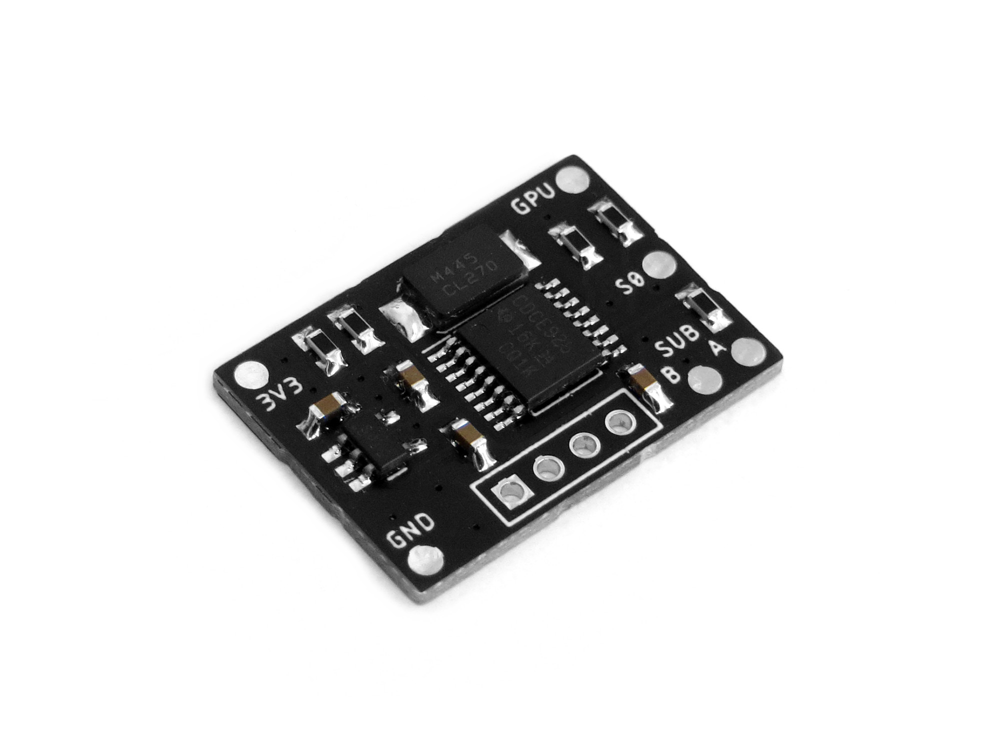
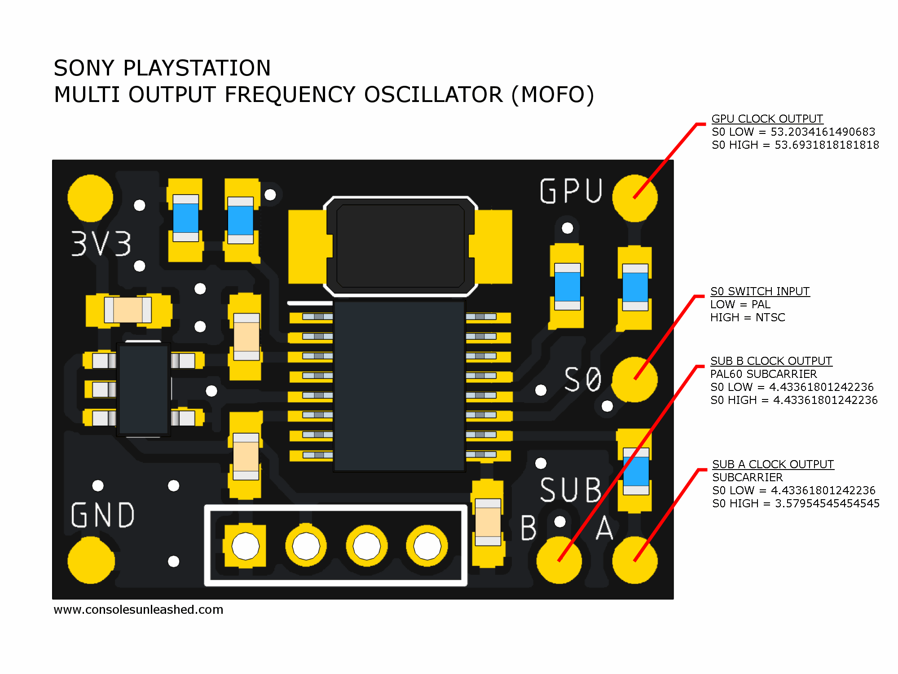
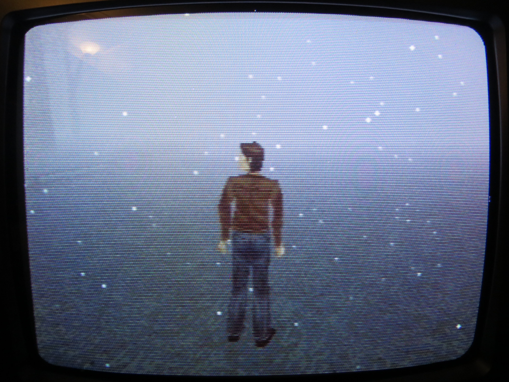

Working on designs to release for free can be both time consuming and expensive. If you like what I do, a small donation will go a long way in helping me continue to serve the modding community as best as I can, with many more free and original guides, designs, and ideas to come.

# Sony PlayStation Multi Output Frequency Oscillator (MOFO)

The multi output frequency oscillator (MOFO) is a dual clock mod for the Sony PlayStation that provides a switchable PAL/NTSC GPU clock and PAL/NTSC RGB Encoder subcarrier clock, as well as a fixed subcarrier clock for PAL60 operation.

## What is the difference between a DFO, MFO, and MOFO?

- The Dual Frequency Oscillator (DFO) provides an auto switching GPU clock output.
- The Multi Frequency Oscillator (MFO) provides an auto switching GPU clock output and an auto switching subcarrier clock output.
- The Multi Output Frequency Oscillator (MOFO) provides an auto switching GPU clock output, an auto switching subcarrier clock output, and an additional fixed subcarrier clock output.

The MOFO is an updated version of the MFO which itself was an updated version of the DFO.

## Composite Video & Single Format TV's

One reason I wanted to design this mod is because I own a single format PAL CRT TV and have been wanting to play Silent Hill in 60Hz via composite video. This results in a black and white image so I would be forced to use RGB or play in 50Hz. Neither of which appeals to me for Silent Hill. So I designed the MOFO.

As you can see by the screenshot, this is a 60Hz image, in colour, and with the correct fog effect over composite video. Thanks to the MOFO's SUB-B clock output, I get a PAL60 signal which my PAL only CRT TV can understand.

## PAL60 & Composite Video Dot Crawl

PAL60 will be prone to the same problems as any standalone PAL60 mod such as dot crawl. The MOFO does not eliminate dot crawl, it is simply a convenient way to generate a PAL60 signal for those that require this mod. However, this may be more in sync and less problematic than standalone PAL60 mods because the clocks are atleast derived from the same clock source.

## Compatibility

PU-8 / PU-18

- GPU output is necessary for correct GPU clock in 50Hz and 60Hz console modes.
- Sub-A output is not necessary because the GPU creates the correct PAL & NTSC subcarrier clocks in all regions.
- Sub-B output can be used to force PAL60 operation for use with TVs that are incompatible with NTSC signals.

PU-20 / PU-22 / PU-23 / PM-41

- GPU output is necessary for correct GPU clock in 50Hz and 60Hz console modes.
- Sub-A output is necessary to get correct PAL & NTSC subcarrier clocks in all regions.
- Sub-B output can be used to force PAL60 operation for use with TVs that are incompatible with NTSC signals.

## Recommended Dual Clock Mod

PU-8 / PU-18

- If using RGB = DFO (or MOFO using GPU clock output only)
- If using composite video & a dual format PAL/NTSC TV = DFO (or MOFO using GPU clock output only)
- If using composite video & a single format TV = MOFO (GPU clock output & Sub-B clock output)

PU-20 / PU-22 / PU-23 / PM-41

- If using RGB = DFO (or MOFO using GPU clock output only)
- If using composite video & a dual format PAL/NTSC TV = MOFO (GPU clock output & Sub-A clock output)
- If using composite video & a single format TV = MOFO (GPU clock output & Sub-B clock output)

## Manufacturing

Nothing special. 1mm PCB is fine.

## Version History

- MOFO v1 - 06/05/2023

## Future Work

- Ability to switch between the standard subcarrier output (SUB-A) or the PAL60 subcarrier output (SUB-B).

## License

If you use this in any way, shape or form, you must include a link back to this repository and mention me by name on any sales pages and social media posts. Not only will this help me to keep designing mod kits and offering them to the community, but it is basic common courtesy as well. Don't be a douchebag. :)

Also this 'GNU GENERAL PUBLIC LICENSE Version 2, June 1991'.

## Donate

Working on designs to release for free can be both time consuming and expensive. If you like what I do, a small donation will go a long way in helping me continue to serve the modding community as best as I can, with many more free and original guides, designs, and ideas to come.

